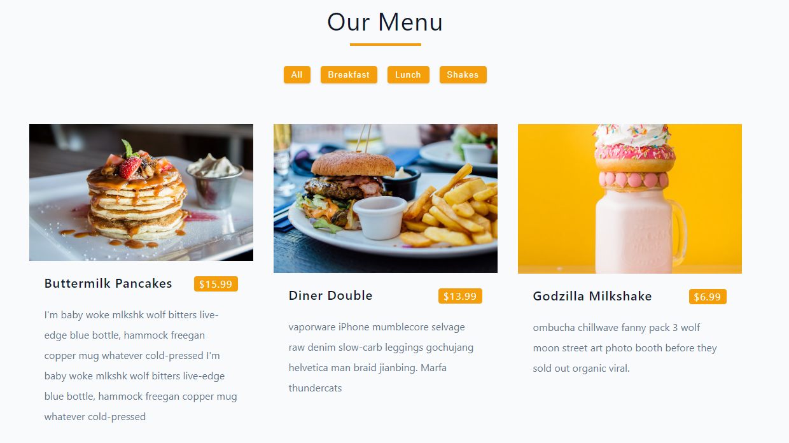

## Our Menu

- Our Menu is a small project where I used the useState hook and seized the opportunity to use a JavaScript Set object for filtering.
- This project has been a valuable contribution to my learning journey with React.

### Technologies Used

- HTML (JSX)
- CSS
- React (Vite)

### Installation

1. Clone the repository:
   `git clone https://github.com/akabaytar/fundamental-projects.git`
2. Navigate to the project directory:
   `cd our-menu`
3. Install dependencies:
   `npm install`
4. Run the project locally:
   `npm run dev`
5. Visit localhost:
   `http://localhost:5173/`

### Screenshot

### License

This project is licensed under the MIT License.

### Contact

For any inquiries or feedback, feel free to contact me at [here](mailto:contact@burakbilgili.co.uk).
